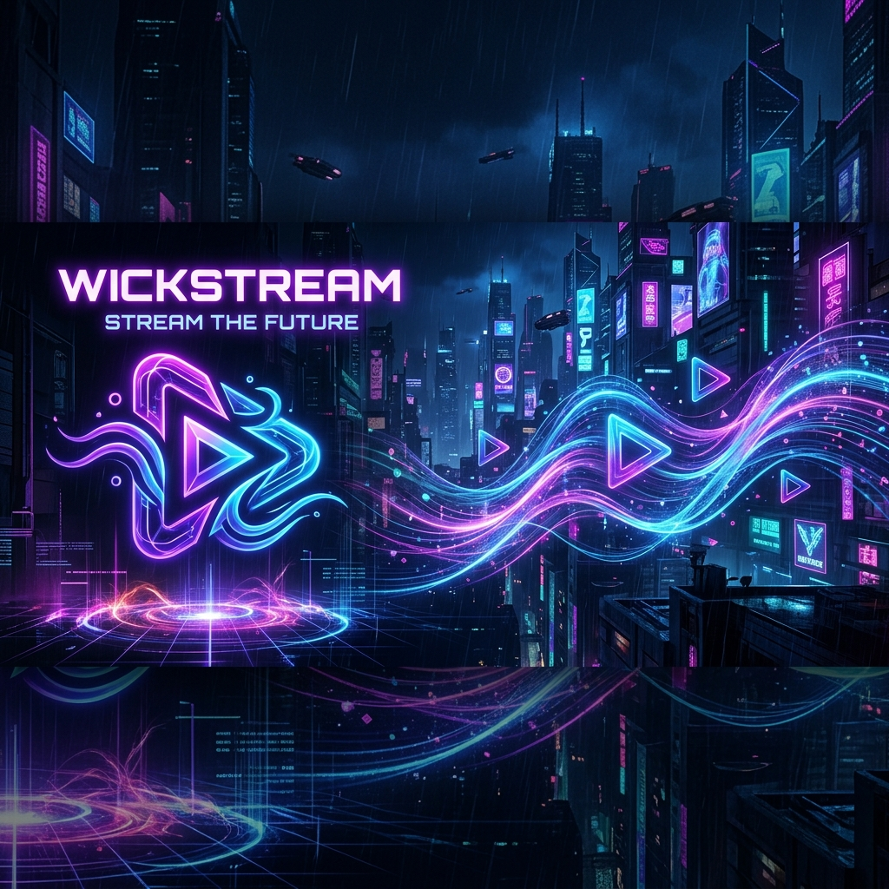
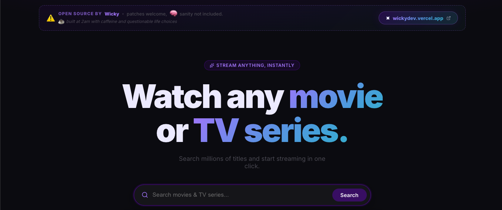

<div align="center">
  

  # 🎬 OmniStream

  **A robust, native desktop streaming client powered by Electron, React, and Express.**

  [](https://opensource.org/licenses/MIT)
  [](#)
  [](#)
  [](#)

</div>

<br />

## 🌟 Overview

OmniStream is an open-source desktop application that provides a seamless, ad-free streaming experience. By combining metadata from public APIs with robust stream extraction techniques, OmniStream offers an elegant interface for exploring and watching your favorite movies and TV series.

<br />
<div align="center">
  
  
  
</div>
<br />

### ✨ Key Features
- **Native Desktop App:** Built with Electron for a fluid, OS-level experience.
- **Rich Metadata:** Powered by the **IMDb** autocomplete API (bypassing heavy WAFs) and **TVMaze** for comprehensive TV show data.
- **Robust Stream Extraction:** Utilizes **PlayIMDb** for intelligent video source extraction and proxying.
- **Ad-Free & Proxied:** All traffic is routed safely through a local Node.js proxy to bypass cross-origin restrictions and deliver an uninterrupted viewing experience.

---

## 🛠️ Architecture & Technologies

OmniStream utilizes a modern monorepo structure, separating the presentation layer from the extraction pipeline.

- **Frontend:** React, Vite, React Router
- **Backend (Local Proxy):** Express.js, Axios, Cheerio, Morgan (Logging)
- **Desktop Shell:** Electron, Electron-Builder

---

## 🚀 Getting Started

Follow these instructions to get a copy of the project up and running on your local machine for development and testing purposes.

### Prerequisites

Ensure you have the following installed:
- [Node.js](https://nodejs.org/) (v18 or higher recommended)
- [npm](https://www.npmjs.com/) or yarn

### Installation

1. **Clone the repository:**
   ```bash
   git clone https://github.com/yourusername/omnistream.git
   cd omnistream
   ```

2. **Install all dependencies:**
   OmniStream uses a single command to install dependencies for the root, frontend, and backend simultaneously.
   ```bash
   npm run install:all
   ```

3. **Start the Development Server:**
   This will boot up the local Express backend, the Vite React dev server, and the Electron wrapper.
   ```bash
   npm run electron:dev
   ```

---

## 📦 Building for Production

You can easily package OmniStream into a standalone executable for macOS or Windows using `electron-builder`.

### Build for macOS (Universal)
Generates a `.dmg` file for macOS (supports both Intel and Apple Silicon).
```bash
npm run dist:mac
```
*Output will be located in the `dist-electron` folder.*

### Build for Windows
Generates a `.exe` installer for Windows.
```bash
npm run dist:win
```
*Output will be located in the `dist-electron` folder.*

---

## 👨‍💻 About the Author

**Created by Nethrough Wickramasinghe**

I'm a passionate developer building sleek, modern applications. If you like this project, feel free to check out my other work!

🌐 **[Visit my Portfolio](https://wickydev.vercel.app/)**

---

## ⚖️ Disclaimer

> [!WARNING]
> **This project is for educational and research purposes only.**
> OmniStream does not host, upload, or manage any media files or copyrighted content on its servers. The application acts strictly as a client-side search tool and proxy, scraping public metadata and aggregating stream links from external, third-party sources. The creator of this software assumes no liability for how this software is used.
